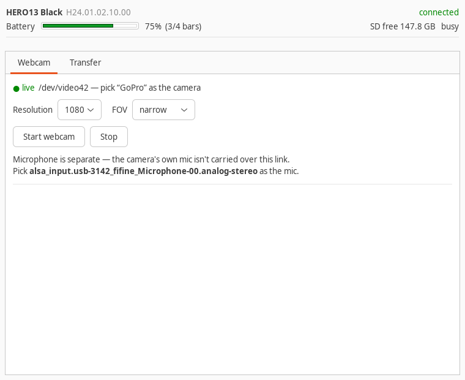
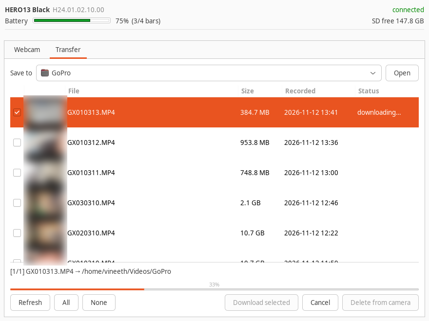

# gopro-linux-panel

Use a GoPro on Linux for the two things it actually gets plugged in for: **being a
webcam**, and **getting the footage off the card**. One GTK window does both, and a
shell wrapper does the webcam half from a terminal.

GoPro ships a webcam driver for macOS and Windows only. On Linux the camera is
still perfectly usable — it just needs someone to ask it nicely over USB. This is
a fork of [jschmid1/gopro_as_webcam_on_linux](https://github.com/jschmid1/gopro_as_webcam_on_linux),
which does the asking; the GUI, the wrapper, the card transfer and the installer
are added here.

| Webcam | Transfer |
|---|---|
|  |  |

*(the thumbnails in the second shot are blurred — they are frames of my own footage,
not part of the UI)*

## What you get

**Webcam tab** — start and stop the stream, choose resolution and field of view,
and see at a glance whether the video node is live, loaded-but-idle, or off.
Changing the FOV while it is streaming applies immediately; no restart.

**Preview** — the picture the video device is actually serving, blur and all,
shown in the panel. It reads V4L2 directly at a downscaled 480x270 and 12 fps, so
watching costs a fraction of what the stream does, and it works when GNOME's
Camera app will not. Only one program can open the camera at a time, so switch
the preview off before joining a call.

**Background blur** — tick a box and the room behind you is blurred *before the
video device*, so the browser, Meet, Zoom, OBS and anything else get an
already-blurred camera. No extension, no Meet setting, nothing to turn on per
call. The strength slider moves while you are streaming.

**Transfer tab** — the card listed with thumbnails, sizes and dates. Tick what you
want, choose a folder, download. Transfers resume if they are interrupted, files
already on disk are marked so you don't fetch them twice, and there's a
delete-from-camera button behind a confirmation that warns you by name about
anything not yet copied across.

**Header** — battery percentage, SD card free space, model and firmware, repolled
every few seconds.

**No mode switching.** Transfer runs over the same GoPro Connect link as the
webcam, through the camera's HTTP API. You never touch the USB Connection menu,
and you can pull files while the webcam is streaming.

## Background blur

Meeting apps that offer blur do it inside their own app, so it only works there —
and on Linux, Meet's blur is often missing or slow. This does it one layer lower:

```
camera --UDP--> ffmpeg --raw--> [ segment | blur | composite ] --raw--> ffmpeg --> /dev/videoN
```

Everything that opens the video device sees the finished picture. There is
nothing to configure in the meeting app, and it works in apps that have no blur
of their own.

Turn it on with the checkbox, or:

```bash
gopro-cam start --blur                 # on, at your configured strength
gopro-cam start --blur --strength 14   # heavier
gopro-cam start --no-blur              # off, whatever the config says
```

The checkbox and slider take effect **on the running stream** — they are written
to a small control file that the worker re-reads — so you can adjust mid-call.
With blur off, frames are copied through untouched.

**It needs mediapipe**, which `install.sh` puts in its own venv
(`~/.local/share/gopro-panel/venv`, about 1 GB) rather than in your system
Python. Say no at the prompt, or set `GOPRO_SKIP_BLUR=1`, and everything else
still works — the checkbox just won't have anything behind it.

**Latency.** A live camera has to drop frames, never queue them. Upstream's
ffmpeg line takes the camera's UDP stream with a 50 MB receive buffer, which is
right for a pipeline that always keeps up and a latency bomb for one that
doesn't: the backlog is queued rather than dropped, so the picture falls further
behind real life for as long as the stream runs, and never recovers.

Dropping cannot be done by peeking at the pipe, either — a pipe holds 64 KB and
a 1080p frame is 6 MB, so there is never a spare frame in it to discard; the
backlog collects *inside* ffmpeg where nothing outside can reach it. So a reader
thread drains the decoder as fast as it will go, keeping only the newest frame
for the processing loop. ffmpeg is never allowed to fall behind, and everything
older than the current frame is dropped on purpose.

The worker reports its own contribution every ten seconds — how long a frame
waits between leaving the decoder and being written out, which is the only part
of the delay it controls:

```
[gopro-blur] 30 fps out, 0 skipped, added delay 3 ms (p95 4 ms)
```

If that number is small and the picture still lags, the delay is the camera's own
encoding and the decode of its stream, not this.

**Speed.** The mask is computed on a small copy of each frame and feathered
while it is still small; the blur is a downscale, a blur and an upscale. The
composite is the expensive part, so it runs on the GPU through OpenCV's OpenCL
path when one is available (`--opencl auto`, the default). Measured against a
live 30 fps stream on a laptop RTX 3060:

| | 720p | 1080p |
|---|---|---|
| OpenCL | keeps up with 30 fps | keeps up with 30 fps |
| CPU only | ~25 fps | ~17 fps |

So on a machine with no usable OpenCL, stay at 720p. If it falls behind it says
so in the log rather than silently dropping frames.

## The other panel: an ordinary USB camera

`cam-panel` is the same idea for a camera the kernel already understands — a Sony
ZV-E10 II, a plain webcam, anything UVC. Those need none of the GoPro machinery:
they arrive as `/dev/videoN` and every app can already use them. What they cannot
do by themselves is blur their background, and the blur stage here does not care
where its frames come from, so a second panel costs almost nothing.

```bash
cam-panel
```

Pick a camera, and it tells you what that camera actually offers rather than what
its box claims — the ZV-E10 II over USB, for instance, is `MJPG 1280x720 @ 25 fps`
and nothing else. Preview it. Then, if you want the background blurred, **Publish
blurred copy**: a loopback node appears as "Blurred", the blur worker feeds it,
and you pick that in your meeting app instead of the camera.

With blur off there is nothing to run — use the camera directly. The only step
that needs root is creating the loopback node, so that one goes through pkexec.

Metadata nodes are filtered out (a UVC camera usually brings one along, and it
enumerates no formats), and so are loopback nodes, so the list is cameras only.

## Requirements

* A GoPro that supports webcam mode over USB (HERO 8 and up; developed against a
  HERO 13 Black)
* `v4l2loopback`, `ffmpeg`, `curl`, `usbutils`, `iproute2`
* GTK 3 with Python bindings, and `python3-requests`, for the GUI
* for background blur: `python3-venv`, and mediapipe (installed into its own venv)
* `polkit` (`pkexec`), so the GUI can ask for a password when it needs root

Debian / Ubuntu:

```bash
sudo apt install -y v4l2loopback-dkms v4l-utils ffmpeg curl usbutils \
                    python3-gi python3-gi-cairo gir1.2-gtk-3.0 python3-requests policykit-1
```

Fedora:

```bash
sudo dnf install -y v4l2loopback v4l-utils ffmpeg curl usbutils \
                    python3-gobject gtk3 python3-requests polkit
```

`v4l2loopback-dkms` builds a kernel module, so it needs your kernel headers
installed. If you have Secure Boot enabled you will also have to enrol a MOK for
the module, or the load silently fails.

## Install

```bash
git clone https://github.com/VineethKumar7/gopro-linux-panel.git
cd gopro-linux-panel
./install.sh
```

Run it **as yourself**, not with `sudo` — it installs into your home and only
elevates for the one file that goes to `/usr/local/sbin`. It checks the
dependencies above and tells you what is missing before it touches anything.

It installs:

| Path | What |
|---|---|
| `/usr/local/sbin/gopro` | upstream's webcam script (needs root to load the module) |
| `~/.local/bin/gopro-cam` | the terminal wrapper |
| `~/.local/bin/gopro-panel` | the GoPro GUI launcher |
| `~/.local/bin/cam-panel` | the ordinary-camera GUI launcher |
| `~/.local/share/gopro-panel/gopro_panel.py` | the GUI |
| `~/.local/share/gopro-panel/gopro_blur.py` | the blur worker (either camera) |
| `~/.local/share/gopro-panel/cam_panel.py` | the ordinary-camera GUI |
| `~/.local/share/gopro-panel/bin/cam-loopback` | creates the loopback node |
| `~/.local/share/gopro-panel/venv` | mediapipe, for blur (optional) |
| `~/.local/share/applications/gopro-panel.desktop` | app-menu entry |
| `~/.config/gopro-panel/config` | settings, if you don't already have one |

`./install.sh --uninstall` reverses all of that and leaves your config alone.

You can also just run it out of the clone without installing:

```bash
./bin/gopro-panel
```

## Set the camera up first

**Preferences → Connections → USB Connection → GoPro Connect.**

This is the whole setup, and it is the first thing to check when nothing works.
On the default *MTP* setting the camera mounts as a disk and nothing here can see
it. On GoPro Connect it appears as a USB **ethernet** device instead — that is
what everything below talks to.

## Using it

```bash
gopro-panel                 # the GUI, also in your app menu as "GoPro Panel"

gopro-cam start             # webcam on, with your configured defaults
gopro-cam start 720 wide    # ... or override resolution and FOV
gopro-cam start --blur      # ... with the background blurred
gopro-cam status
gopro-cam stop
gopro-cam nudge             # make GNOME's Camera app notice the device
```

Closing the panel window does **not** stop the camera. The GUI runs the stream
as its own transient user service (`gopro-panel-stream`), so a webcam is not cut
off mid-call by the window that happened to start it; Stop ends it.

`start` is two halves — `setup`, which loads the kernel module and asks the
camera to stream, and `stream`, which carries frames to the video device and
holds the terminal. Only `setup` needs root, so the GUI elevates that one alone
and runs the frame-carrying half as you.

Apps enumerate cameras when they start, so start the webcam **before** opening
Zoom or your browser. If you start it afterwards, Zoom finds it on a rescan in
Settings → Video and Firefox usually needs a page reload.

**The camera's microphone is not carried over this link.** Only video arrives.
Pick a separate microphone in whatever app you're using; put a substring of its
PulseAudio name in `MIC_MATCH` and both tools will remind you which one it is.

## Configuration

`~/.config/gopro-panel/config`, read by the GUI and the shell wrapper alike:

```ini
VIDEO_NR=42               # the /dev/videoN to create
FOV=linear                # linear | narrow | wide | superview
RESOLUTION=1080           # 1080 | 720 | 480
DEST_DIR=~/Videos/GoPro   # where the Transfer tab saves
MIC_MATCH=fifine          # substring of your microphone's PulseAudio source
BLUR=off                  # blur the background by default
BLUR_STRENGTH=8           # how much, 1-30
GOPRO_SCRIPT=             # upstream's `gopro`, if it isn't in /usr/local/sbin
```

The GUI writes `BLUR` and `BLUR_STRENGTH` back here when you change them, so the
checkbox remembers itself.

`linear` is still noticeably wider than a normal webcam; `narrow` is the one to
pick if you want to look like everyone else on the call.

## How it works

Over USB in GoPro Connect mode the camera is an ethernet device (`enx…`) that
hands your machine a `/24` and sits on `.51` of it. Everything is HTTP to that
address.

**Webcam.** Upstream's `gopro` script asks the camera to start its webcam stream;
the camera sends MPEG-TS to **UDP 8554**; `ffmpeg` pipes that into a
**v4l2loopback** node, which is an ordinary `/dev/videoN` as far as every
application is concerned. Root is needed only to load `v4l2loopback`, which is
why the GUI's Start and Stop go through `pkexec` and nothing else does.

**Transfer.** The same address serves GoPro's Open API:

| Endpoint | Used for |
|---|---|
| `/gopro/camera/info` | model, firmware |
| `/gopro/camera/state` | status `70` battery %, `2` battery bars, `54` SD free (KB), `10` recording |
| `/gopro/media/list` | what's on the card |
| `/gopro/media/thumbnail?path=DIR/FILE` | thumbnails |
| `http://<ip>:8080/videos/DCIM/DIR/FILE` | the file itself — honours `Range`, so downloads resume |
| `/gp/gpWebcam/SETTINGS?fov=N` | change FOV on a running stream (wide 0, narrow 2, superview 3, linear 4) |

Status `8` ("busy") stays high the entire time webcam mode runs, so the panel
suppresses it while streaming rather than showing a permanent warning.

## Troubleshooting

**`sudo gopro: command not found`** — the webcam script isn't installed. Run
`./install.sh`, or point at a clone with `GOPRO_SCRIPT=/path/to/gopro`.

**"No GoPro on USB"** — check `lsusb | grep -i gopro`. If it's there but the panel
says disconnected, the camera is on MTP; switch it to GoPro Connect.

**The video node never appears** — `modinfo v4l2loopback` should print a filename.
If it doesn't, the DKMS build failed: check your kernel headers, and Secure Boot.

**Zoom/Firefox can't see the camera** — start the webcam before the app, or make
the app rescan.

**"Could not play camera stream", or the device lists no formats** — nothing is
feeding it. `v4l2-ctl -d /dev/video42 --list-formats-ext` on a fed device shows
`YU12 1920x1080 @ 30fps`; on an unfed one the list is empty and the device
reports `Video Output` only, which is exactly what a consumer chokes on. Check
`gopro-cam status`, and start the stream again.

**GNOME's Camera app (Snapshot) crashes when you switch to the GoPro.** It is a
bug in Snapshot, not in the camera. `tests/consumer-matrix.sh` feeds the node one
pixel format at a time and checks each consumer in turn; on Ubuntu 24.04 with
Snapshot 46.2 the result is the same whatever it is given:

| format | device lists it | direct V4L2 read | PipeWire source | PipeWire plays | Snapshot |
|---|---|---|---|---|---|
| I420 1920x1080 | yes | yes | yes | no | **SEGV** |
| I420 1280x720 | yes | yes | yes | no | **SEGV** |
| YUYV 1280x720 | yes | yes | yes | no | **SEGV** |
| YUYV 640x480 | yes | yes | yes | no | **SEGV** |

Read that left to right: the device is fine — it enumerates its format and any
program reading V4L2 gets frames. PipeWire even builds a camera source. What
fails is streaming *through* PipeWire, and Snapshot segfaults rather than
reporting it, which makes a working camera look broken.

So don't judge the camera by that app. **Chrome, Firefox, Zoom, Meet and OBS read
the device directly** and are unaffected. The panel's **Preview** button shows the picture
inside the panel itself if you just want to see it.

**GNOME's Camera app (Snapshot) or Cheese shows the built-in webcam instead** —
those two take cameras from PipeWire rather than reading V4L2 themselves, and
PipeWire only registers a camera source if the device advertised *capture* when
it probed it. With `exclusive_caps=1` — which Chrome insists on — a loopback node
is output-only until something feeds it, so a node created before the stream
started never becomes a PipeWire source. `gopro-cam nudge` (or the panel's
**Rescan** button) restarts WirePlumber so it looks again; neither needs root.

**Order matters, and this is the part that wastes an afternoon.** WirePlumber
decides whether a device is a camera at the moment it probes it. Nudge while the
stream is *down* and you get a device with no camera source — which is exactly
what "could not play camera stream" looks like from the app, so it reads as a
broken camera rather than a missing one. `nudge` therefore refuses to run unless
the node is actually being fed, and confirms a source appeared afterwards instead
of assuming it did.
Chrome, Firefox, Zoom and OBS read the device directly and are unaffected — which
is why video calls work even when the Camera app looks empty.

**Blur is greyed out or the worker exits immediately** — mediapipe isn't
installed. Re-run `./install.sh` and say yes to the venv.

**"would not accept video — is something else already writing to it"** — an
older ffmpeg still owns the loopback node. `gopro-cam stop`, then start again.

**The camera's light stays on after stopping** — it is still in webcam mode.
`gopro-cam stop` ends that too (`/gp/gpWebcam/STOP` then `/gopro/webcam/exit`),
and so does the GUI's Stop, which does the camera half itself so that cancelling
the password prompt still turns the light off. If the light survives both, the
camera stopped answering: unplug it.

**Only one video format is offered** (`YU12 1920x1080 @ 30fps`). That is what the
loopback node is created with; it is not a bug.

**Don't pass `-n 42` to upstream's `gopro` script.** It gives `-n` to both
`--non-interactive` and `--video-number` and matches non-interactive first, so the
`42` is silently dropped as a stray argument. `bin/gopro-cam` uses the long form
`--video-number` for exactly this reason.

## Tests

`tests/consumer-matrix.sh` answers "can anything actually read this device?" It
needs the camera already streaming (`gopro-cam setup`) and the node free
(`systemctl --user stop gopro-panel-stream`), then feeds it each pixel format in
turn and reports, per format, whether the device enumerates it, whether a direct
V4L2 read works, whether PipeWire builds a camera source, whether a PipeWire
consumer can play it, and whether GNOME Snapshot survives.

```bash
./tests/consumer-matrix.sh
COMBOS="yuv420p:1280:720 yuyv422:640:480" ./tests/consumer-matrix.sh
```

It waits for the writer to attach rather than sleeping a fixed amount — ffmpeg
cannot set a format until it has decoded a frame, and joining a live stream means
waiting for the next I-frame, so a fixed sleep measures impatience rather than
the device.

## Licensing

Upstream is **Apache-2.0**, which is permissive and does not require derivative
work to carry the same terms. So everything added by this fork is **MIT** — the
freest licence available without relicensing anybody else's work.

* `LICENSE` — Apache-2.0, covering upstream's files (`gopro`, `prepare_webcam.sh`,
  `gopro_webcam.service`, `60-gopro.rules`, and the two files kept verbatim as
  `*.upstream.*`). None of them has been edited.
* `LICENSE-MIT` — covering everything added here: `gopro_panel.py`,
  `gopro_blur.py`, `bin/`, `share/`, `install.sh`, this README.

`NOTICE` spells out which file falls under which, and records the two upstream
files that were renamed to make room. Read that before redistributing.

## Credits

The hard part — working out that the camera is an ethernet device and that it will
stream MPEG-TS at you over UDP — is [Joshua Schmid's](https://github.com/jschmid1),
in `gopro_as_webcam_on_linux`. This fork wraps it and adds the card transfer.
